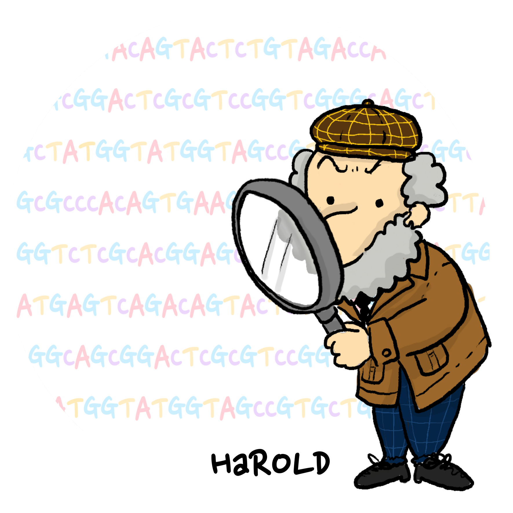

# HaROLD - HAplotype Reconstruction Of Longitudinal Deep sequencing data
<p align="center">



## Overview
HaROLD reconstructs haplotypes based on identifying co-varying variant frequencies using a probabilistic framework. For more details, please refer to [our paper] [our preprint](https://academic.oup.com/ve/article/8/2/veac093/675) in Virus Evolution.

## Usage

HaROLD requires Java 8 (or newer). Download pre-built binaries from [releases](https://github.com/ucl-pathgenomics-HaROLD/releases/tag/v2.0.0).

#### Prepare input files
This step might not be necessary depending on software used for alignment. Tested with bam files produced by Bbmap and bwa. 
Convert the BAM files using [Samtools](http://www.htslib.org).

```sh
samtools view -h -G69 to.convert.bam | samtools view -h -G133 > file.bam
```

For every sample, generate a strandcount.csv from the BAM file (some examples of this step can be found in the "example" folder)

```sh
java -cp /your-path-to-HaROLD/lib/htsjdk-unspecified-SNAPSHOT.jar:\
/Your-path-to-HaROLD/lib/picocli-4.1.2.jar:\
/Your-path-to-HaROLD/lib/pal-1.5.1.jar:\
/Your-path-to-HaROLD/lib/cache2k-all-1.0.2.Final.jar:\
/Your-path-to-HaROLD/lib/commons-math3-3.6.1.jar:\
/Your-path-to-HaROLD/jar/MakeReadCount.jar makereadcount.MakeReadCount file.bam
```

#### Step 1 - Running HaROLD
HaROLD requires as input file only a list of strandcount.csv files. Longitudinal data are listed together, but separate samples from different runs need to be submitted separately. 
Data and examples used in the simulation in the paper can be found in the "simulation" folder.
For example, if you have 4 longitudinal samples from the same patient, your sample.txt will look like:

```sh
sampleA_timepoint1.strandcount.csv
sampleA_timepoint2.strandcount.csv
sampleA_timepoint3.strandcount.csv
sampleA_timepoint4.strandcount.csv
```

View program options:

```sh
java -jar /your-path-to-HaROLD/jar/Cluster_RG/dist/HaROLD-2.0.jar --help
```
```sh
Usage: 

richards-haplotype-model [-AhHLNvV] [--alpha-frac=<alpha_frac>]
                                [--threads=<threads>] [--tol=<tol>]
                                [-o=<optimiser>] [-p=<prefix>]
                                [-s=<randomSeed>] [-a=<initialAlphaParams>
                                <initialAlphaParams>]... -c=<countFile>...
                                [-c=<countFile>...]...
                                [-f=<initialFreqFile>...]... -n=<haplotypes>...
                                [-n=<haplotypes>...]...

      --alpha-frac=<alpha_frac>
                            Fraction of sites to use to optimise error parameters
      --threads=<threads>
      --tol=<tol>
  -a, --initial-alpha=<initialAlphaParams> <initialAlphaParams>

  -A, --fix-alpha           Fix alpha parameters
  -c, --count-file=<countFile>...
                            file containing list of count files
  -f, --initial-freq-file=<initialFreqFile>...
                            optional file containing hap frequency values
  -h, -?, --help            give this help list
  -H, --printHaplotypes     Print haplotypes
  -L, --printLikelihoods    Print likelihoods
  -n, --haplotypes=<haplotypes>...
                            number of haplotypes
  -N, --noOpt               Process without optimising
  -o, --optimiser=<optimiser>
                            Optimiser for haplotype frequencies
  -p, --prefix=<prefix>     Results file prefix
  -s, --seed=<randomSeed>
  -v, --verbose
  -V, --version
```

For example, the following command was used in our simulation with norovirus data (details in the paper):


```sh
java -jar /your-path-to-HaROLD/jar/Cluster_RG/dist/HaROLD-2.0.jar \
--count-file sample.txt --haplotypes 4 --alpha-frac 0.5 --gamma-cache 10000 \
-H -L --threads 4 -p /your-path-to-results/Step1_results
```

This step produces three output files: 

- your-path-to-results/Step1_results.log: log file 
- your-path-to-results/Step1_results.fasta: haplotypes fasta sequences 
- your-path-to-results/Step1_results.lld: base frequency file 


##### A note about choosing the number of haplotypes

The log file (your-path-to-results/Step1_results.log) provides the total likelihood for the model (at the end of log file, "Main: Final total likelihood"). You should try different numbers and choose the number of haplotypes that gives you the highest likelihood. However, the following step will help to find the best number. 

#### Step 2 - Refining Output from HaROLD


The algorithm takes a set of reads for different samples and calculates the optimal probability of the haplotypes for each of the samples as well as the optimal sequences of the haplotypes. We are going to adjust the haplotype frequencies and sequences, use these values to assign reads,and then calculate log likelihood based on these assigned reads. 
The required input files are: 

- output files from Harold step1
- reference sequence in Fasta format 
- BAM files 

View program options:

```sh
java -cp /your-path-to-HaROLD/lib/htsjdk-unspecified-SNAPSHOT.jar: \
/your-path-to-HaROLD/lib/picocli-4.1.2.jar: \
/your-path-to-HaROLD/lib/pal-1.5.1.jar: \
/your-path-to-HaROLD/lib/commons-math3-3.6.1.jar: \
/your-path-to-HaROLD/lib/cache2k-all-1.0.2.Final.jar: \
/your-path-to-HaROLD/lib/flanagan.jar: \
/your-path-to-HaROLD/jar/RefineHaplotypes.jar refineHaplotypes.RefineHaplotypes -h
```
```sh
Usage: richards-haplotype-model [-hIV] [--expand] [--printIntermediate]
                                [--printReference]
                                --alignment=<hapAlignmentFile>
                                --bam=<readsFile> --baseFreq=<baseFreqFile>
                                [-D=<minReadDepth>] [--errorRate=<errorRate>]
                                [--hapFreq=<hapFreqFile>] [-m=<minReads>]
                                [--maxHaplo=<maxHaplo>]
                                [--maxIterate=<maxIter>]
                                [--maxRecombine=<maxRecombine>]
                                --reference=<refSeqFile> [--seed=<randomSeed>]
                                -t=<tag>

      --alignment, --hapAlignment=<hapAlignmentFile>
                            Name of haplotype alignment file, fasta (req)
      --bam, --BAM, --sam, --SAM=<readsFile>
                            Name of bam/sam file (req)
      --baseFreq=<baseFreqFile>
                            Name of base frequency file (req)
  -D, --minReadDepth=<minReadDepth>
                            Minimum read depth (<0 indicates inactive) (-1.)
      --errorRate=<errorRate>
                            Error rate (0.002)
      --expand              Consider splits that increase number of haplotypes
                              (false)
  -h, -?, --help            give this help list
      --hapFreq=<hapFreqFile>
                            Name of haplotype frequency file (null)
  -I, --iterate             Turn on iteration (false)
  -m, --minReads=<minReads> Minimum number of reads (20.0)
      --maxHaplo, --maxHaplotypes=<maxHaplo>
                            Maximum number of haplotypes (10)
      --maxIterate=<maxIter>
                            Maximum number of iterations (10)
      --maxRecombine=<maxRecombine>
                            Maximum number of recombination attempts (20)
      --printIntermediate   Print intermediate sequences (false)
      --printReference      Print reference sequence (false)
      --reference, --refSequence, --referenceSequence=<refSeqFile>
                            Name of file containing reference sequence, fasta
                              (req)
      --seed=<randomSeed>   Random number seed (-1, not specified)
  -t, --tag=<tag>           Tag for output files (req)
  -V, --version
```

Here, we show an example for sample2 for the first Norovirus longitudinal set in the simulation (referred in the paper as "2 haplotypes, low similarity, 5 time points set"). Run this for every sample.

```sh
java -cp /your-path-to/lib/htsjdk-unspecified-SNAPSHOT.jar: \
/your-path-to-HaROLD/lib/picocli-4.1.2.jar: \
/your-path-to-HaROLD/lib/pal-1.5.1.jar: \
/your-path-to-HaROLD/lib/commons-math3-3.6.1.jar: \
/your-path-to-HaROLD/lib/cache2k-all-1.0.2.Final.jar: \
/your-path-to-HaROLD/lib/flanagan.jar: \
/your-path-to-HaROLD/jar/RefineHaplotypes.jar refineHaplotypes.RefineHaplotypes \
-t sample2 --bam sample2-1longitudinal.sorted.dedup.bam.fixed.bam \
--baseFreq nhaplo_4_results.lld --refSequence refseq-JX459907.fasta \
--hapAlignment nhaplo_4_resultsHaplo.fasta --iterate
```

This step produces two output files for each sample: 

- your-path-to-results/Sample2.log: log file
- your-path-to-results/Sample2.fasta: haplotypes fasta sequences for a sample


## Getting help

If you have any questions, please feel free to contact [Juanita Pang](mailto:juanita.pang.16@ucl.ac.uk), [Cristina Venturini](mailto:c.venturini@ucl.ac.uk)  or [Richard Goldstein](mailto:r.goldstein@ucl.ac.uk).
